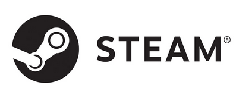
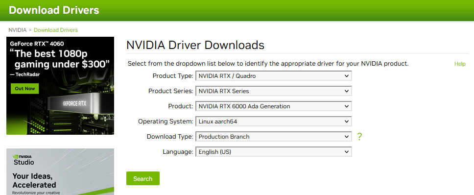
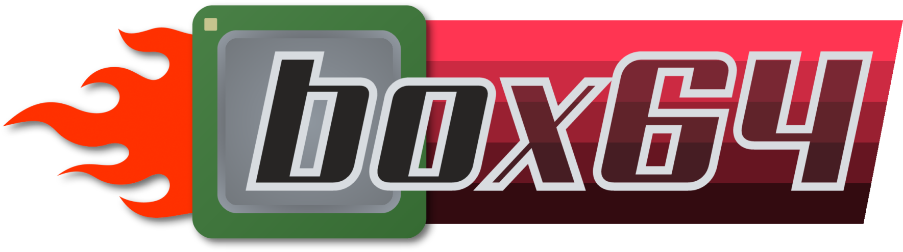

# Steam-on-Ampere

## Summary

This how-to explains running Vive Steam on Ampere platform via Box86/Box64. Much thanks to our [ADLINK](https://www.ipi.wiki) friends for this!
## Running Steam on Ampere Altra 

Steam is a video game digital distribution service and storefront from Valve. It was launched as a software client in September 2003 to provide game updates automatically for Valve's games, and expanded to distributing third-party titles in late 2005. 
https://en.wikipedia.org/wiki/Steam_(service)




The bummer is that the Steam portal that runs on Linux is purely coded for x86/amd64 based system, that is why the Steam Deck is based on AMD.

So could it work on arm64 at all ?? 

**Yes it can !!** 

And it runs quite stable on arm64 when using the x86 emulation tools available to us today. 

How to get it operational is the first step in this journey and how to get it optimized will be an ongoing story in this document


For the system we have been using to try this out we started with a quite moderate configuration : 

- AADP32 with 2x 16GB DDR4       buy it here :   https://www.ipi.wiki/products/ampere-altra-developer-platform
- Nvidia RTX 6000                            check out the AVL of cards that are know to work on arm64


The below software installation covers :  

- Getting a desktop on Ubuntu server
- Manually installing Nvidia arm drivers
- (correctly) Installing the x86 and amd64 emulation layers 
- Installing Steam

This will provide you with a setup that allows you to tryout games that are enabled for Linux (x86/amd64 that is)


"Soon" to come 

- A list of programs that have been tested under the non-wine install : " working / not working"  
- Integration with wine to allow Windows games to run on Linux
- Proton, other optimization ?


### Setting up the Desktop on Ubuntu Server 20.04

AADP comes standard installed with Ubuntu Server 20.04. There is currently no off the shelve desktop version of Ubuntu 20.04. Although the 22.04 server environment is working smoothly we did find that installing the desktop there leads to problems so stay away from 22.04 for Steam at this time.   

If you need  to reinstall Ubuntu Server 20.04 than you can find it here : https://cdimage.ubuntu.com/releases/20.04/release/

So your starting point for below instructions is a clean  

Ubuntu Server 20.04.5  (64-bit ARMv8/Arch64) server install 


Boot up the system login and first thing to do is 

  ```sh
  $ sudo apt update
  $ sudo apt upgrade
  ```


Next step is installing the standard ubuntu desktop environment, we use `tasksel` for this. 
Some background about tasksel can be found here : https://linuxconfig.org/ubuntu-20-04-gui-installation 

```sh
$ sudo apt install tasksel
$ sudo tasksel install ubuntu-desktop
$ sudo systemctl set-default graphical.target
$ sudo reboot
```

When the system gets back up you should see your familiar Desktop environment. 


### Installing the Nividia driver

Forget about using the the standard Ubuntu utility "Software & Updates" for this, since Desktop is not part of the official distribution for arm64, there are no arm64 drivers being distributed. You will have to find the driver on the Nidia homepage and install it manually under Ubuntu desktop. 

Navigate to :   https://www.nvidia.com/download/index.aspx

And select the driver here : 




Copy the file to your home directory on the AADP system. 

Make sure the file is executable, if not make it executable with 

```sh
sudo chmod +x  NVIDIA-Linux-aarch64-xxx.xx.xx.run
```


Next thing to do is to blacklist  the open source nouveau driver that is automatically loaded and that would prohibit us from installing the Nvidia propriety driver. 

Create and edit a file called `blacklist-nouveau.conf` as follows 

```sh
$ sudo touch /etc/modprobe.d/blacklist-nouveau.conf
$ sudo nano /etc/modprobe.d/blacklist-nouveau.conf
```

Add the following lines to the file :
`blacklist nouveau`
`options nouveau modeset=0`

save the file and than : 

```sh
$ sudo update-initramfs -u
```

You will get a warning message something like this :  `W: Possible missing firmware /lib/firmware/ast_dp501_fw.bin for module ast`  but you can ignore this. 

```sh
$ sudo reboot
```

You now login to a desktop that has no driver loaded for your Nvidia card.  

Before actual driver installation you will need some libraries and tools

```sh
$ sudo apt-get install g++ freeglut3-dev build-essential libx11-dev libxmu-dev libxi-dev libglu1-mesa-dev libfreeimage-dev libglfw3-dev
```

than run the installer 

```sh
$ sudo ./NVIDIA-Linux-aarch64-535.54.03.run
```

This is a menu driven install, make sure you select to have Nvidia as your default desktop configuration. 
(just as a warning do not do above steps remotely through ssh because your local desktop environment settings will not be updated)

```sh
$ sudo reboot
```

Et voila !


### Installing Box86 and Box64 emulation


Box86 is an emulator for x86 userspace tools on ARM Linux systems, allowing such systems to execute video games and other programs that have been compiled for x86 Linux systems. Box86 is an alternative to QEMU for user-mode emulation. Box86 also provides dynamic recompilation as well as functionality to intercept dynamic library calls and forward them to equivalent native libraries, allowing applications to run significantly faster than if they were fully emulated. https://en.wikipedia.org/wiki/Box86

Very detailed instructions can be found on the github site of the developer   https://github.com/ptitSeb/box86

Box 86  is an amazing achievement and although the focus for box86 and box64 is now on gaming it might have many more application down the road. 

Box86 homepage : https://box86.org/

To keep it simple and easy to reproduce we choose here to install the online debs because there are too many dependencies to fulfill manually to compile box86, that depends on the `armhf` architecture and box64 that supposedly depends on the standard `arm64` architecture. 


#### Box86
We use [@Itai-Nelken](https://github.com/Itai-Nelken)'s apt repository to install precompiled box86 debs, updated weekly.

```sh
sudo wget https://itai-nelken.github.io/weekly-box86-debs/debian/box86.list -O /etc/apt/sources.list.d/box86.list
wget -qO- https://itai-nelken.github.io/weekly-box86-debs/debian/KEY.gpg | sudo gpg --dearmor -o /etc/apt/trusted.gpg.d/box86-debs-archive-keyring.gpg
sudo apt update && sudo apt install box86:armhf -y
```

Note that we are installing `box86:armhf`, do not install `box86`


#### Box64


We use [@ryanfortner](https://github.com/ryanfortner)'s apt repository to install precompiled box64 debs, updated every 24 hours.

```sh
$ sudo wget https://ryanfortner.github.io/box64-debs/box64.list -O /etc/apt/sources.list.d/box64.list
$ wget -qO- https://ryanfortner.github.io/box64-debs/KEY.gpg | sudo gpg --dearmor -o /etc/apt/trusted.gpg.d/box64-debs-archive-keyring.gpg
$ sudo apt update && sudo apt install box64-generic-arm -y
$ sudo systemctl restart systemd-binfmt
```


### Installing Steam

Again we stick to the script of simplicity and use the shell program called install_steam.sh form 


WIP

